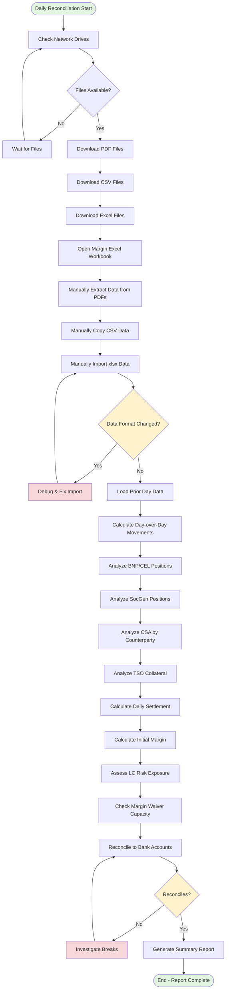

# Current State Analysis: Margin Reconciliation Process

**Date**: 2026-07-23  
**Process**: Margin_Explain  
**Type**: Manual Excel-based workflow

---

## Purpose

Daily reconciliation and explanation of collateral movements across multiple clearing and counterparty relationships:
- **Exchange collateral**: BNP clearer (CEL legal entity), SocGen cleared activity
- **CSA margin**: Counterparty Credit Support Annex agreements
- **TSO collateral**: Transmission System Operator margins
- **Initial margin waiver capacity**: Tracking utilization

The process provides visibility into what drives margin movements day-over-day and reconciles cashflows to bank accounts.

---

## Current Workflow

### Inputs
1. **Source files** from network drives (end-of-day positions):
   - PDF files
   - CSV files  
   - Excel (.xlsx) files
2. **File formats are unstable** - providers can change structure at their discretion
3. **Existing messy agent code** at: `C:\Users\bryantl4\OneDrive - Centrica\Documents\0. AGENTS\MCU`
4. **Previous day's data** for comparison

### Process Steps (Manual)
1. Retrieve end-of-day files from network drives
2. Open Excel workbook (example: `CeMarginMoveSummary_20260722.xlsm`)
3. Manually import/copy data from PDF, CSV, xlsx sources
4. Compare current day to prior day positions
5. Calculate movements and variances
6. Summarize by:
   - Commodity movements (BNP clearer, CEL entity)
   - Daily spot settlement
   - Initial margin movements
   - SocGen cleared activity
   - CSA margin movements by counterparty
   - TSO collateral changes
7. Calculate LC (Letter of Credit) risk exposure
8. Determine initial margin waiver capacity usage
9. Reconcile cashflows to bank account movements

### Outputs
- Excel workbook with margin movement summary
- Manual explanations of key drivers
- Reconciliation to bank accounts

### People Involved
- **Users**: Team members performing daily reconciliation
- **Stakeholders**: Those requiring margin movement explanations
- **Data providers**: Systems/teams generating PDF/CSV/xlsx files

---

## Current State Flowchart

---

## Pain Points

### 1. **No Historical Data Store**
- Cannot compare balances between arbitrary dates
- Limited to day-over-day comparisons only
- No trend analysis capability

### 2. **Data Source Fragility**
- Source files in PDF, CSV, xlsx can change format without notice
- Manual intervention required when formats change
- Breaks the process and requires debugging

### 3. **Manual Data Entry**
- Time-consuming copy/paste operations
- Error-prone transcription
- No validation of imported data

### 4. **Excel as Single Source of Truth**
- Excel file is not robust for multi-user access
- No audit trail of changes
- Version control issues
- No concurrent access

### 5. **Existing Agent Code is Messy**
- Built without engineering principles
- Difficult to maintain
- Needs rationalisation

### 6. **Limited Analysis Capability**
- Cannot slice data by:
  - Traded product (open trade equity)
  - CSA by counterparty
  - Date range comparisons
- No drill-down capability

### 7. **No Automation**
- Daily manual process
- No consideration of weekends/bank holidays
- No scheduled data retrieval

### 8. **Exception Handling**
- No visibility into process breaks
- No alerting mechanism
- Manual investigation required

---

## Risks

1. **Operational Risk**: Manual process prone to human error
2. **Timeliness Risk**: Delayed reconciliation if files late or process breaks
3. **Data Quality Risk**: No validation of imported data accuracy
4. **Compliance Risk**: Poor audit trail for regulatory review
5. **Business Continuity Risk**: Knowledge locked in Excel and manual process
6. **Scalability Risk**: Cannot handle increased volume or complexity

---

## Success Criteria for New Solution

### Must Have
1. **Database-backed storage** of all historical margin data
2. **Automated daily data ingestion** from network drives (PDF, CSV, xlsx)
3. **Flexible date range analysis** - compare any two end-of-day positions
4. **Intuitive web UI** for querying and visualizing movements
5. **Reconciliation to bank accounts** - cashflows must tie out
6. **Exception visibility** - breaks/errors surfaced in UI
7. **Configurable scheduling** - users set data retrieval schedule
8. **Weekend/holiday awareness** - intelligent scheduling

### Analysis Capabilities
- Filter by traded product (open trade equity on exchange)
- Filter by CSA counterparty
- Filter by daily settlement on exchange
- Drill-down into commodity movements
- Track initial margin waiver capacity usage
- LC risk exposure calculation

### Non-Functional
- **Robust**: Handle format changes gracefully
- **Auditable**: Track all data loads and changes
- **Accessible**: Web-based, no Excel dependency
- **Maintainable**: Clean code following Farley principles

---

## Data Model (Preliminary)

### Key Entities
- **MarginPosition**: Daily snapshot per margin type
- **Clearer**: BNP, SocGen
- **Counterparty**: CSA counterparties
- **Product**: Commodities being traded
- **Settlement**: Daily spot settlements
- **InitialMargin**: Margin postings
- **BankMovement**: Cash reconciliation
- **DataSource**: Track source files and load status

---

## Open Questions

1. **Network drive access**: How will the application authenticate to network drives? Service account? User credentials?

2. **Data retention**: How long should historical data be retained? Any regulatory requirements?

3. **File parsing logic**: Is there documentation for the expected structure of PDF/CSV/xlsx files, or do we reverse-engineer from examples?

4. **Error handling**: When a file format changes, should the system:
   - Alert and pause?
   - Attempt intelligent parsing?
   - Fall back to manual upload?

5. **Existing agent code**: Should we extract any reusable parsing logic from `C:\Users\bryantl4\OneDrive - Centrica\Documents\0. AGENTS\MCU`?

6. **User roles**: Are there different user types (viewer, analyst, admin) with different permissions?

7. **Real-time vs batch**: Should margin data be near real-time or is end-of-day batch sufficient?

8. **Integration points**: Does the solution need to integrate with other systems (treasury, risk, accounting)?

9. **Notification requirements**: Who needs to be alerted when:
   - Data load fails?
   - Reconciliation breaks?
   - Margin exceeds thresholds?

10. **Deployment environment**: On-premises, cloud, or hybrid? Any infrastructure constraints?

---

## Next Steps

1. **Architect** will design the future-state solution addressing these pain points
2. **Tester** will define acceptance criteria for MVP
3. **Builder** will implement following TDD principles

---

*Analysis complete. Awaiting approval to proceed to design phase.*
